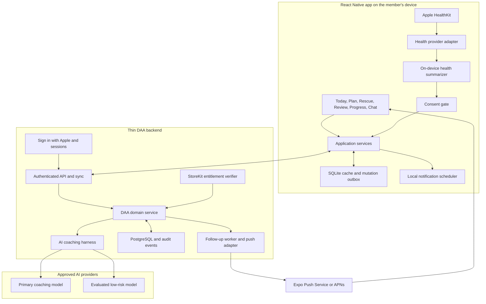

# DAA Mobile and AI Harness Architecture

Status: proposed implementation baseline

Date: 2026-07-17

This document turns the existing DAA method into an iOS-first React Native
product. It supersedes the client technology and web-surface decisions in
`V2_PRODUCT_AI_ROADMAP.md`. The roadmap's domain, safety, structured-memory,
evaluation, and provider-neutral principles still apply.

## Executive Decision

DAA should be a **mobile-only user product with a thin backend**.

- Build one React Native application, launch on iOS first, and preserve Android
  compatibility at domain and adapter boundaries.
- Use Expo with a development build, not Expo Go. A development build supports
  custom native libraries and configuration required by HealthKit.
- Do not build a customer-facing web app in the first version. Only static
  privacy, terms, support, and account-deletion pages are required outside the
  app.
- Keep a small backend for authentication, synchronized state, AI secrets,
  model routing, adaptive push notifications, subscriptions, export, and
  deletion.
- Keep HealthKit access on the device. Read only explicitly approved types,
  produce a small summary locally, and transmit that summary only after separate
  consent.
- Include chat, but do not make DAA merely a chat screen. Structured daily flows
  are the product; chat is the flexible coaching surface around them.
- Start the harness with deterministic rules, typed records, strict model
  contracts, and fake adapters. Add remote AI only after the behavior can be
  tested without a model.

The useful distinction is:

> Mobile-only means the member sees and uses one mobile app. It does not mean
> every product responsibility belongs on the phone.

## Decision Record

| Question | Decision | Reason |
| --- | --- | --- |
| Product surface | Mobile app only for V1 | Accountability is most useful at the moment of choice, where the phone and notifications already are. |
| Mobile framework | React Native, TypeScript, Expo development build | One codebase, native-module access, cloud iOS builds, and a practical future Android path. |
| First platform | iOS | HealthKit, notification actions, StoreKit, and a controlled first beta. |
| Backend | Thin API and worker | A model key cannot be shipped in an app; the product also needs sync, adaptive pushes, entitlements, and deletion. |
| Local persistence | SQLite plus an idempotent outbox | Fast startup, offline check-ins, and reliable later sync. |
| Server persistence | PostgreSQL | Exact, auditable queries for plans, commitments, check-ins, consent, and trends. |
| Health integration | HealthKit read-only and opt-in | Health data adds context but must not become a requirement or a surveillance score. |
| Android health path | Health Connect adapter | Google recommends Health Connect for mobile-first health integrations as Fit APIs reach end of support. |
| Chat | Yes, secondary to structured flows | It handles nuance without hiding the daily plan, rescue, and review behind an empty text box. |
| AI access | Backend provider gateway | Protects keys and allows task-based models, budgets, fallbacks, and provider review. |
| RAG/vector store | Not in the MVP | The initial method is small and curated; user records belong in SQL, not embeddings. |
| MCP | Not inside the core | Add later only at external integration boundaries such as calendars or other agent clients. |
| Fine-tuning | No | Prompts, contracts, memory, safety, and evaluations come first. |

## Product Method Translated Into Software

The MyBodyTutor source material and DAA's existing method point to the same
product loop: a plan must be personal, support must be daily and proactive, and
the system must help at the difficult moment rather than only explain nutrition
afterward.

| Method insight | Product behavior |
| --- | --- |
| Patterns occur as a sequence | Capture `context -> cue -> state -> interpretation -> choice -> action -> result` and look for the earliest useful intervention. |
| Food can answer hunger or another need | Rescue asks whether the current driver is hunger, emotion, fatigue, habit, craving, social pressure, or unclear. It never treats that answer as a diagnosis. |
| Different situations need different strategies | Store which small response was tried and whether it helped; do not prescribe one universal craving trick. |
| Removing a behavior without a replacement is fragile | Rescue proposes a small alternative that addresses the likely need. |
| A lapse becomes worse through all-or-nothing thinking | The lapse flow immediately asks for the next normal useful action and records recovery time. |
| Consistency needs daily accountability | Morning plan, difficult-moment rescue, evening review, and a weekly experiment form the core cadence. |
| A plan must fit real life | Onboarding captures schedule, preferences, constraints, difficult times, and coaching style. |
| Long-term success is independence | Weekly review names one self-coaching skill and can gradually reduce prompts. |

MyBodyTutor currently sells access to a real human coach. DAA must not imitate
that claim. The app should clearly identify itself as an AI accountability coach,
avoid language that pretends a model has human feelings, and direct medical,
nutrition, eating-disorder, injury, and crisis concerns to qualified people.

## Mobile Experience

The first screen is `Today`, not a marketing page and not an empty chat.

### Primary Surfaces

1. **Today**
   - Up to three observable commitments across eating, gym, recovery, work, or
     another selected goal.
   - The next check-in and one likely difficult moment.
   - One-tap `kept`, `adapted`, `missed`, and `recovered` actions.
   - A persistent Rescue action.

2. **Morning Plan**
   - A guided flow under five minutes.
   - Today's primary outcome, up to three commitments, broad meal plan, movement
     or recovery plan, likely disruption, and one `If X, then Y` response.

3. **Rescue**
   - Fast entries for `Craving`, `I slipped`, `Restaurant`, `Gym resistance`, and
     `Plan changed`.
   - One question at a time and low cognitive load.
   - A specific action for the next ten minutes, then an optional follow-up.

4. **Evening Review**
   - Commitment statuses, factual eating and activity reflection, at most one
     lapse examined in depth, one concrete win, and one adjustment for tomorrow.

5. **Progress**
   - Weekly commitment counts, recovery time, repeated situations, strategies
     that helped, and one seven-day experiment.
   - Weight is shown as an agreed trend, never as a judgment on one reading.

6. **Coach Chat**
   - Open-ended support with awareness of today's plan and recent relevant
     records.
   - Can open a structured flow, propose a plan change, or save a check-in after
     confirmation.
   - Is not the source of truth for memory.

7. **Settings and Privacy**
   - Notification cadence and quiet hours.
   - Health permissions and exactly which summaries may be shared with AI.
   - Coaching style, language, retention, export, disconnect, and deletion.

### Why Chat Is Secondary

Chat is valuable when a member says something the forms did not anticipate. It
is weak as the only interface because it makes routine actions slower and lets
important state disappear into transcripts. DAA therefore uses this rule:

> Conversation explains and adapts; typed records remember and measure.

## System Architecture



### Responsibility Boundaries

The device owns:

- the complete mobile experience
- HealthKit authorization and raw HealthKit reads
- local notification scheduling for predictable morning and evening prompts
- the offline cache and mutation outbox
- explicit user approval before a proposed AI action becomes a sensitive write

The backend owns:

- API credentials and model-provider access
- user authentication, authorization, tenant isolation, and canonical sync state
- exact calculations, state transitions, idempotency, and audit events
- AI context assembly, safety routing, tool execution, and provider selection
- adaptive remote follow-ups, subscription entitlements, export, and deletion

The model owns only:

- interpreting a current situation from supplied evidence
- drafting a concise, non-shaming coaching response
- proposing one next question or a small set of actions
- interpreting code-computed trends for a weekly reflection

The model never reads HealthKit or PostgreSQL directly, calculates adherence,
changes a commitment, schedules a notification, or saves a health summary by
itself.

## Why a Backend Is Necessary

A backendless prototype can support local forms, SQLite, HealthKit, fixed local
notifications, and a fake or eligible on-device model. That is useful for a UI
and harness spike.

It is not an acceptable commercial remote-AI architecture because:

- provider API keys are secrets and must not be embedded in a mobile app
- adaptive follow-ups need a trusted scheduler and push sender
- subscription entitlements need server verification
- account sync, cross-device recovery, export, and deletion need canonical state
- model routing, budgets, abuse controls, safety updates, and provider changes
  cannot depend on shipping a new app build

The backend should remain thin. Do not build a web dashboard, microservices,
Kafka, a separate vector database, or a complex workflow engine for V1. One API,
one worker process, and one PostgreSQL database are enough.

## Health Integration

### V1 HealthKit Scope

HealthKit is optional and the app remains fully useful without it. Ask for access
only after onboarding explains a concrete member benefit.

Read-only candidates, each separately permissioned:

- workouts and workout duration
- steps or active energy for movement context
- sleep duration for recovery context
- body mass only when the member explicitly chooses weight tracking

Do not request clinical records, blood glucose, reproductive data, continuous
heart-rate samples, location, or unrelated health types in V1. Do not write to
HealthKit in V1.

HealthKit gives separate permission by data type and intentionally makes denied
read access look like absent data. The adapter must therefore represent
`unknown`, `not requested`, `not available`, and `available` without guessing
why a value is missing.

### Health Context Envelope

Raw samples remain on-device. The app converts them to a bounded envelope:

```json
{
  "source": "apple_healthkit",
  "window": {
    "start": "2026-07-17T00:00:00-06:00",
    "end": "2026-07-17T18:00:00-06:00"
  },
  "consentVersion": "health-ai-v1",
  "metrics": {
    "workoutCompleted": true,
    "workoutMinutes": 47,
    "steps": 6830,
    "sleepMinutes": null
  },
  "missing": ["sleep"]
}
```

Before sending, the user chooses which metric categories may be used for AI
coaching. The backend stores the minimum summary needed for the selected feature
and its consent version, not the underlying samples. Health data must never be
used for advertising, marketing profiles, or punitive notifications.

### Cross-Platform Boundary

The domain sees a `HealthContextProvider`, not HealthKit classes:

```text
HealthContextProvider
  authorize(categories)
  authorizationState(category)
  summarize(window, categories)
  revokeLocalUse()

iOS: AppleHealthKitProvider
Android later: HealthConnectProvider
Tests: FakeHealthContextProvider
```

The first technical spike must compare maintained React Native HealthKit
libraries against a small Expo native module. No community package should leak
its types into the domain contracts.

## AI Coaching Harness

The harness is the controlled runtime around a model. It makes a model useful,
testable, and replaceable.

```mermaid
flowchart LR
    INPUT["Structured flow or chat message"]
    PRE["Deterministic input and safety checks"]
    MODE["Mode router"]
    CONTEXT["Minimum context builder"]
    PROTOCOL["DAA protocol and policy"]
    ROUTER["Task and risk model router"]
    MODEL["Model call"]
    VALIDATE["Schema and output safety validation"]
    PROPOSE["Response plus proposed actions"]
    EXECUTE["Validated domain commands"]
    STORE["Records and audit event"]
    FOLLOW["Local or remote follow-up"]

    INPUT --> PRE --> MODE --> CONTEXT --> PROTOCOL --> ROUTER --> MODEL
    MODEL --> VALIDATE --> PROPOSE --> EXECUTE --> STORE --> FOLLOW
```



### Turn Pipeline

1. Build an input envelope with user ID, locale, timezone, source, explicit mode,
   and message or form fields.
2. Run deterministic red-flag and prohibited-advice checks before ordinary
   coaching.
3. Route explicit buttons without AI. Use classification only for ambiguous
   free text.
4. Load only the minimum context: profile fields relevant to the turn, today's
   plan, a few recent matching events, and an approved health summary if needed.
5. Attach the selected DAA protocol and safety policy.
6. Select a model by task, risk, latency, evaluated quality, and cost.
7. Require a strict structured response.
8. Validate response shape, claims, proposed writes, and safety route.
9. Present sensitive mutations as proposals when confirmation is required.
10. Execute accepted commands in application code, persist an audit event, and
    schedule an appropriate follow-up.

### Model Output Contract

```ts
type CoachTurnResult = {
  mode:
    | "onboarding"
    | "morning_plan"
    | "rescue"
    | "lapse_recovery"
    | "evening_review"
    | "weekly_review"
    | "general_chat";
  message: string;
  nextQuestion?: string;
  proposedActions: Array<{
    type:
      | "save_check_in"
      | "set_commitment_status"
      | "adapt_commitment"
      | "schedule_follow_up";
    payload: unknown;
    requiresConfirmation: boolean;
  }>;
  safety: {
    route: "normal" | "qualified_help" | "urgent_help";
    flags: string[];
  };
  trace: {
    promptVersion: string;
    policyVersion: string;
  };
};
```

Every action has its own narrower runtime schema. `payload: unknown` above is a
union placeholder, not permission to accept arbitrary data.

### Initial Model Tools

Keep the tool surface small and use strict schemas:

- `get_today_plan`
- `get_relevant_recent_events`
- `propose_daily_plan`
- `save_completed_check_in`
- `set_commitment_status`
- `record_behavior_event`
- `schedule_follow_up`
- `get_week_aggregates`

Read tools return minimized views. Write tools enforce authorization, consent,
state transitions, idempotency keys, and version checks in code. For V1, the
model may propose a plan or adaptation, but the member confirms it before the
write.

### Model Routing

| Task | Execution |
| --- | --- |
| Save/read a record | Application code, no model |
| Calculate counts, trends, or recovery time | SQL/application code |
| Route an explicit Rescue button | Deterministic code |
| Classify ambiguous free text | Small evaluated model with a fallback |
| Extract check-in fields from chat | Small model with strict schema and confirmation |
| Normal coaching turn | Primary approved coaching model |
| Difficult-moment coaching | Primary model plus deterministic safety checks |
| Weekly interpretation | Primary model over code-computed aggregates |
| Safety red flag | Deterministic policy and strongest approved response path |

Provider and model IDs are runtime configuration. A less expensive provider can
receive only approved low-risk task classes after it passes the same DAA quality,
safety, structured-output, latency, privacy, retention, and residency review.

### Memory, RAG, and MCP

DAA memory has three layers:

1. PostgreSQL and local SQLite for exact user facts and consented records.
2. A small context packet assembled for the current turn.
3. Later, a curated retrieval index for larger reviewed educational material.

Do not embed the entire chat history in V1. Query recent records by mode, date,
context, cue, and outcome. Add RAG only when the reviewed knowledge corpus is too
large for a versioned prompt package. Add MCP only when DAA needs a standard
external tool boundary; it is not the internal service architecture.

## Core Data Model

The first server schema should cover:

- `users` and `profiles`
- `goals`
- `daily_plans`
- `commitments`
- `commitment_results`
- `check_ins`
- `behavior_events`
- `health_summary_consents`
- `health_summaries`
- `weekly_reviews`
- `notification_preferences`
- `follow_ups`
- `subscriptions`
- `ai_run_metadata`
- `audit_events`

The core event statuses remain `kept`, `adapted`, `missed`, and `recovered`.
Missing check-ins are unknown, not failures. Store timestamps in UTC with the
member's IANA timezone on the relevant plan or event.

### Sync Rule

The app creates mutations with a UUID, entity version, and device timestamp. The
API processes each UUID at most once and returns the canonical record version.
The outbox retries safely after a network failure. Conflicts are handled by the
domain command, not generic last-write-wins behavior.

Chat transcripts are optional supporting records. They do not replace daily
plans, check-ins, behavior events, or consent records.

## Notifications

Use two delivery paths:

- **Local notifications** for predictable morning planning, evening review, and
  user-created reminders. They work without a backend connection.
- **Remote push** for adaptive follow-ups, a completed weekly review, sync or
  account events, and server-controlled experiments.

Every notification follows these rules:

- opt-in, configurable cadence, timezone awareness, and quiet hours
- one useful invitation or question, with a deep link to the exact flow
- generic lock-screen text by default; no weight, eating lapse, emotion, or
  health value in the push payload
- cancel or update reminders when the underlying action is completed or adapted
- no guilt language for an ignored or missed notification

## Safety and Privacy Requirements

- DAA is accountability and behavior support, not medical care, nutrition
  treatment, psychotherapy, or emergency service.
- Never invent calorie, macro, medication, supplement, or rapid weight-loss
  prescriptions.
- Never recommend starvation, purging, dehydration, punishment exercise, or
  ignoring pain, dizziness, exhaustion, or injury.
- A user who already goes to the gym every day must not be pressured to train
  through a needed recovery day.
- Run deterministic escalation checks for eating-disorder behavior, acute
  symptoms, self-harm, and conflicting clinician guidance.
- Store API keys only in backend secret storage. The mobile app receives a DAA
  session token, never a provider key.
- Disclose each third-party AI provider and obtain permission before sharing
  personal data with it.
- Redact raw coaching and health content from ordinary logs, analytics, crash
  reports, push payloads, and model traces.
- Provide in-app consent review, export, account deletion, and HealthKit
  disconnect controls.
- Do not use HealthKit data for advertising, marketing, or unrelated analytics.
- Prefer aggregate product events such as `morning_plan_completed`; never attach
  meal text, weight, health values, or emotional disclosures to analytics.

## Recommended Technical Shape

```text
apps/
  mobile/                 React Native + Expo app
  api/                    TypeScript HTTP API and worker entry points
packages/
  domain/                 Pure DAA entities, commands, policies, and protocols
  contracts/              Runtime schemas and generated API types
  coach-harness/          Routing, context, prompts, tools, safety, model gateway
  persistence/            SQLite and PostgreSQL adapters
  testing/                Fixtures, fake clock/providers, eval cases
docs/
  decisions/              Small architectural decision records
  MOBILE_HARNESS_ARCHITECTURE.md
```

Recommended baseline:

- pnpm workspaces with TypeScript project references
- Expo Router and an Expo development build
- `expo-sqlite` for the local cache and outbox
- secure OS-backed storage for session and refresh tokens
- a maintained HealthKit library or a small Expo native module behind the
  `HealthContextProvider` interface
- Node.js TypeScript API with a small HTTP framework
- PostgreSQL with migrations and row-level authorization enforced by the API
- shared runtime schemas for client, API, and model tool boundaries
- a provider-neutral model gateway; OpenAI Responses can be the first adapter
- local Expo notifications first; an abstract push adapter for Expo Push Service
  or direct APNs
- one PostgreSQL-backed worker before introducing a separate queue service

Expo cloud development builds allow iOS device builds to be triggered from
Windows, although iPhone signing requires a paid Apple Developer account. The
HealthKit integration still needs testing on a physical iPhone; a simulator and
mock provider are not enough for release verification.

## Delivery Plan

### Phase 0: Harness Foundation

- Move existing method, protocols, and safety rules behind pure TypeScript
  interfaces without changing their meaning.
- Define `CoachInput`, `CoachTurnResult`, domain commands, records, and health
  summary contracts.
- Implement a deterministic mode router for buttons and fast commands.
- Add fake clock, fake model, fake health provider, and fixture-based tests.
- Create safety and coaching-quality regression cases before selecting models.

Exit signal: morning, rescue, lapse, evening, and weekly scenarios run in tests
with no network and no mobile UI.

### Phase 1: Local Mobile Vertical Slice

- Scaffold the Expo development-build app.
- Implement onboarding, Today, Morning Plan, Rescue, Evening Review, Progress,
  and Settings.
- Add SQLite, the outbox, and local notifications.
- Use the fake model adapter or deterministic copy while the UI is tested.

Exit signal: one person can complete a full seven-day loop offline and export
the local records.

### Phase 2: Thin Backend and Remote AI

- Add Sign in with Apple, API authorization, PostgreSQL, sync, and deletion.
- Add the model gateway, strict tools, safety pipeline, redacted traces, and eval
  gates.
- Add remote adaptive follow-ups without sensitive push content.

Exit signal: the same fixture scenarios pass against the API and one approved
model; retries do not duplicate records.

### Phase 3: HealthKit

- Add granular read permissions and a read-only HealthKit adapter.
- Add on-device summary generation, explicit AI-sharing consent, missing-data
  handling, disconnect, and deletion.
- Verify on a physical iPhone and test revoked or partially granted permissions.

Exit signal: DAA remains fully usable with no permission, partial permission,
revoked permission, offline mode, and an unavailable HealthKit store.

### Phase 4: Private Beta and Subscription

- Add StoreKit subscriptions and server-side entitlement state.
- Measure activation, check-in completion, rescue use, four-week retention,
  recovery time, notification opt-out, safety escalations, and cost per active
  member.
- Add Android only after the domain contracts are stable and the iOS loop shows
  evidence of repeated use.

## First Implementation Slice

The next code change should be the harness contract package, not the visual app
shell and not a live model call:

1. Create the workspace structure.
2. Implement the input/output schemas and pure mode router.
3. Add five golden scenarios: morning plan, craving, lapse recovery, gym
   resistance, and evening review.
4. Run them through a fake model adapter.
5. Only then scaffold the Today and Rescue screens against those contracts.

That order makes React Native, OpenAI, another provider, and a future native
client replaceable adapters around the same DAA behavior.

## Source Basis

- Existing repository documents: `ARCHITECTURE.md`, `core/method.md`,
  `core/protocols.md`, `core/safety-policy.md`, and
  `docs/V2_PRODUCT_AI_ROADMAP.md`.
- The private Adam Gilbert/MyBodyTutor emails previously analyzed for DAA,
  paraphrased into pattern, hunger-versus-cue, replacement, craving, and recovery
  behavior. No proprietary course text is reproduced.
- [MyBodyTutor Daily Coach](https://www.mybodytutor.com/daily-coach) for its
  current personalized-plan, daily-accountability, and human-coach product flow.
- [Expo development builds](https://docs.expo.dev/develop/development-builds/create-a-build/)
  for native libraries, native configuration, and iOS cloud builds.
- [Expo SQLite](https://docs.expo.dev/versions/latest/sdk/sqlite/) for persisted
  local storage.
- [Expo Notifications](https://docs.expo.dev/versions/latest/sdk/notifications/)
  and [Apple local notifications](https://developer.apple.com/documentation/UserNotifications/scheduling-a-notification-locally-from-your-app)
  for scheduled delivery.
- [Apple HealthKit privacy](https://developer.apple.com/documentation/healthkit/protecting-user-privacy)
  and [HealthKit configuration](https://developer.apple.com/documentation/xcode/configuring-healthkit-access)
  for granular authorization and disclosure.
- [Apple App Review Guidelines](https://developer.apple.com/app-store/review/guidelines/)
  for health data, third-party AI disclosure, privacy, and subscription rules.
- [Android Fit migration guide](https://developer.android.com/health-and-fitness/health-connect/migration/fit)
  for the future Health Connect adapter.
- [OpenAI API authentication](https://developers.openai.com/api/reference/overview#authentication)
  for keeping provider keys out of client applications.
- [OpenAI function calling](https://developers.openai.com/api/docs/guides/function-calling)
  for application-executed tools and strict structured boundaries.
