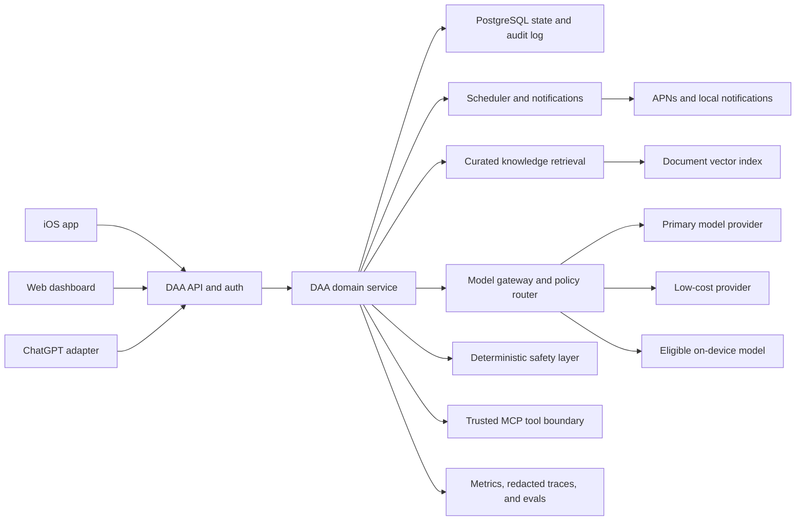

# DAA V2 Product and AI Roadmap

Status: proposed

Date: 2026-07-13

Scope: what V1 still lacks, which AI capabilities DAA should adopt, and how DAA can become a subscription product without making model cost or health-data risk the center of the product.

> Supersession note (2026-07-17): The mobile client, web surface, and related
> product-delivery decisions in this roadmap are superseded by
> [`MOBILE_HARNESS_ARCHITECTURE.md`](MOBILE_HARNESS_ARCHITECTURE.md). DAA now
> targets an iOS-first React Native/Expo app as its only user-facing product,
> supported by a thin backend. The AI, safety, data, evaluation, and
> provider-neutral principles below remain applicable.

## Executive Decision

DAA should become a provider-neutral service with an iOS-first client and a small web surface.

- Build the backend and domain API first so the same accountability system can power ChatGPT, iOS, web, and later Android.
- Build the first consumer app in native SwiftUI. Timely notifications, fast rescue actions, optional HealthKit access, widgets, Shortcuts, camera, voice, and StoreKit are unusually important to an accountability product.
- Use the web for onboarding, account and privacy controls, history, the weekly dashboard, support, and administration. Do not make a full web coaching app the first paid product unless user testing shows that desktop use is dominant.
- Do not fine-tune a model for V2. First build structured memory, deterministic tools, safety rules, evaluations, and model routing. These produce more value and cost control with much less data risk.
- Use RAG for a small, curated coaching knowledge base. Do not use a vector store as the primary database for user check-ins.
- Use MCP when DAA needs a standard interface to several external tools or needs to expose DAA tools to ChatGPT and other agents. MCP is an integration protocol, not memory and not RAG.
- Support multiple model providers behind one gateway. Cheaper providers, including DeepSeek or Qwen, may be tested for low-risk tasks only after they pass DAA's evaluation suite and a privacy, retention, residency, and contract review.

The immediate V2 priority is not "more AI." It is reliable state, safety, measurement, and delivery around a small amount of well-controlled AI.

## V1 Baseline

V1 already establishes the product's behavioral core:

- provider-neutral coaching method and session protocols
- profile, daily check-in, and weekly-review schemas
- morning planning, evening review, difficult-moment rescue, lapse recovery, and weekly analysis
- fast commands for craving, restaurant, lapse, gym resistance, and plan changes
- local JSON as the canonical private store
- scheduled ChatGPT check-ins and a separate weekly analyst
- a private Google Sheets dashboard projection
- explicit health, nutrition, emotional-support, escalation, and data-minimization boundaries

That is a strong prototype. It proves the coaching loop before we invest in a product shell.

## What V1 Still Lacks

| Gap | Why it matters | V2 decision |
| --- | --- | --- |
| Production state store | Local JSON cannot safely support multiple devices, concurrent writes, migrations, backups, or many users. | Add PostgreSQL with versioned records, migrations, transactions, and an audit log. Keep exportable JSON as a portability format. |
| Authentication and tenant isolation | A commercial product must prevent one user's health and behavior data from reaching another user. | Add Sign in with Apple, short-lived sessions, per-user authorization, and automated isolation tests. |
| Consent, retention, export, and deletion | Accountability data can reveal health, routines, emotions, and locations. Users need control over what is kept and shared. | Add granular consent, retention settings, data export, account deletion, provider disclosure, and an auditable deletion workflow. |
| Encryption and secret management | Private data and provider keys cannot live in app code or ordinary logs. | Encrypt in transit and at rest, use managed key and secret storage, and redact sensitive fields from logs and traces. |
| Deterministic persistence tools | V1 describes when to read and write, but the model can still be asked to carry too much state-management responsibility. | Implement strict tools such as `get_today_plan`, `save_check_in`, `record_commitment_result`, and `get_week_summary`. |
| Reliable scheduling and notifications | ChatGPT schedules prove the cadence, but a product needs delivery, retries, timezone handling, quiet hours, and notification preferences. | Add a job service plus APNs. Use local notifications for predictable reminders and server pushes for adaptive follow-ups. |
| Product UI | Chat is useful, but daily accountability also needs one-tap completion, a quick rescue entry, history, trends, and privacy controls. | Build an iOS app with Today, Rescue, Check-in, Progress, and Settings surfaces. |
| Model gateway | The architecture is provider-neutral in principle, but provider routing, fallback, budgets, and version pinning are not implemented. | Add one internal model interface with provider adapters, task-based routing, timeouts, fallbacks, and per-run cost records. |
| Evaluation suite | A prompt or model change can silently make coaching less useful or less safe. | Create versioned test cases, graders, safety cases, regression thresholds, and human review samples before changing production behavior. |
| Observability | V1 cannot answer whether check-ins arrive, tools fail, costs rise, or users recover faster. | Record latency, model and tool errors, notification delivery, token cost, funnel events, and privacy-safe quality signals. |
| Enforced safety escalation | V1 has a good written safety policy, but production needs reliable detection and response paths. | Add deterministic red-flag checks, restricted tool behavior, reviewed response templates, and local emergency-resource lookup. |
| Curated knowledge and citations | The method is defined, but future educational answers need bounded, updateable sources. | Add a small reviewed knowledge base with source metadata, retrieval, citations, and expiry/review dates. |
| Billing and entitlements | There is no way to test a sustainable paid service. | Add StoreKit subscriptions, server-side entitlement state, trials, refunds and grace-period handling, and usage budgets. |
| Analytics and experiments | We do not yet know which cadence, rescue flow, or plan format improves retention or follow-through. | Add consented product analytics and controlled experiments that never use HealthKit data for advertising. |
| Reliability and support operations | A paid accountability service needs recovery from outages and a way to resolve access or billing problems. | Add backups, restore tests, idempotency, status monitoring, support tooling, and incident procedures. |
| Accessibility and localization | Check-ins must remain easy during stressful moments and for users with different abilities and languages. | Build Dynamic Type, VoiceOver, reduced-motion support, strong contrast, and English/Spanish localization into the iOS MVP. |

## AI Feature Decisions

| Capability | Decision | DAA use | Timing |
| --- | --- | --- | --- |
| Structured memory | Build first | Profiles, commitments, check-ins, outcomes, consent, and weekly experiments belong in typed records queried by date and user. | V2 foundation |
| Function calling and structured outputs | Build first | Let the model request narrow operations while application code validates and executes them. OpenAI recommends strict function schemas for reliable adherence. | V2 foundation |
| Guardrails | Build first | Detect safety red flags, block disallowed advice or writes, constrain sensitive actions, and require approval when appropriate. | V2 foundation |
| Evals and trace review | Build first | Compare prompts and providers on coaching quality, non-shaming tone, correct tool use, grounded pattern claims, and safety escalation. | V2 foundation |
| Model gateway and routing | Build first | Use a small model for extraction and classification, a stronger model for nuanced coaching, and deterministic code for calculations and policy. | V2 foundation |
| Prompt caching | Use | Keep stable method, safety, and tool definitions at the start of prompts and user-specific context later. Measure cache reads and writes. | V2 |
| Batch processing | Use offline only | Run large evaluations, reclassify historical de-identified events, or prepare non-urgent aggregate analysis. It is not appropriate for live rescue or daily coaching. | V2 |
| RAG | Add narrowly | Retrieve from approved DAA method notes, public health guidance, product help, and safety resources, then cite the source. | V2 after core data |
| Vector store | Add only for documents | Store and search the curated unstructured knowledge corpus. Do not make it the source of truth for plans, commitments, weights, or check-ins. | V2 after corpus exists |
| Embeddings over user history | Defer | Semantic search may later find similar situations, but date, context, cue, and outcome filters are safer and more explainable at first. Require explicit consent before embedding private history. | V3 candidate |
| MCP | Use at integration boundaries | Expose or consume standardized tools for calendars, DAA records, notifications, and approved services. Keep sensitive write tools allowlisted and approval-gated. | Late V2 |
| Multi-agent workflows | Keep minimal | Continue with one coach and one non-coaching analyst. More agents add latency, cost, and hard-to-debug handoffs without clear user value. | No expansion in V2 |
| Fine-tuning or "basic training" | Defer | Training can improve a narrow task or style, but it does not create current knowledge, durable user memory, or safety. Current OpenAI documentation also says its fine-tuning platform is being wound down for new users. | Revisit after product-market fit |
| On-device Apple model | Use opportunistically | Perform low-risk local tagging, extraction, draft summaries, or text refinement on eligible devices. Always provide a fallback and never rely on it alone for safety decisions or complex coaching. | iOS V2 enhancement |
| Voice and vision | Defer from MVP | Voice can reduce check-in friction and meal photos can support reflection, but both increase cost, privacy work, and review complexity. | V2.1 or V3 |

OpenAI's [function calling guide](https://developers.openai.com/api/docs/guides/function-calling) recommends strict mode so calls adhere to their schemas. Its [file search guide](https://developers.openai.com/api/docs/guides/tools-file-search) describes hosted semantic and keyword search over uploaded files, while the [retrieval guide](https://developers.openai.com/api/docs/guides/retrieval) explains that vector stores are indices for semantic search. These are different jobs from DAA's transactional user database.

## MCP, RAG, and Vector Stores in Plain Language

**MCP answers: "What can the agent do outside the model?"**

Examples: read a calendar, write a check-in, schedule a notification, or retrieve a HealthKit summary through a trusted service. MCP standardizes discovery and invocation of external tools. It should not become DAA's internal business logic. OpenAI warns that remote MCP servers are third-party services, can receive sensitive data, and should be trusted, allowlisted, logged, and approval-gated for sensitive actions in its [MCP guide](https://developers.openai.com/api/docs/guides/tools-connectors-mcp).

**RAG answers: "Which approved knowledge should the model read before answering?"**

Examples: retrieve the relevant DAA rescue protocol or a reviewed educational source before answering a question. RAG is the full pattern of retrieving relevant material and using it to generate a grounded answer. Retrieval results need source metadata and citations.

**A vector store answers: "How do we index and semantically search unstructured text?"**

It can power RAG, but it is only one component. A vector store is useful for source documents whose wording varies. It is a poor primary store for questions such as "Did this user keep Tuesday's gym commitment?" A relational query is cheaper, exact, auditable, and easier to delete.

**DAA memory should use three layers:**

1. Relational state for facts and consent: profiles, goals, plans, check-ins, measurements, commitments, subscriptions, and notification settings.
2. A curated retrieval index for approved educational and product knowledge.
3. A short model context assembled for the current moment, containing only the minimum relevant state.

## Proposed V2 Architecture



Architectural rules:

- The model never connects directly to the production database.
- Every write uses a narrow validated tool and carries user, consent, version, and idempotency context.
- Safety checks can override routing and prevent an ordinary coaching response.
- Provider adapters receive the minimum data required for the task.
- Logs and traces exclude raw health text by default.
- The backend owns entitlement and usage policy, not the iOS client.
- User-facing trends are calculated in code from structured records, not invented by a model.

## Model and Cost Strategy

Do not choose one model for everything. Route by task and risk.

| Workload | Preferred execution | Reason |
| --- | --- | --- |
| Save or read a check-in | Deterministic application code | No model is needed. |
| Calculate adherence, streak-independent trends, or recovery time | SQL/application code | Exact, cheap, testable, and auditable. |
| Classify a message into a DAA mode | Small low-cost model or local classifier | Short, constrained output with an easy fallback. |
| Extract structured check-in fields | Small model with strict schema | Low-complexity transformation that can be validated. |
| Generate a normal morning or evening reflection | Capable mid-tier model | Needs personalization and tone, but not maximum reasoning every time. |
| Difficult-moment coaching | Capable model plus deterministic safety checks | Nuance and low latency matter. |
| Weekly pattern analysis | Capable model over code-computed aggregates | The model interprets evidence; code supplies the counts. |
| Safety red flag | Deterministic rules plus strongest approved safety path | Never down-route a safety event merely to save money. |
| Large regression suite | Batch API or provider batch equivalent | Non-interactive work can trade latency for lower cost. |

Implementation rules:

- Configure providers and model IDs outside application code. Model catalogs and prices change.
- Pin evaluated snapshots for production where the provider supports them.
- Give every request a task class, risk class, latency budget, token budget, fallback order, and maximum cost.
- Store model, prompt version, latency, token usage, cache use, tool errors, and evaluation result without storing raw sensitive text in ordinary telemetry.
- Put stable instructions and tool schemas first so repeated prefixes benefit from [prompt caching](https://developers.openai.com/api/docs/guides/prompt-caching).
- Use the [Batch API](https://developers.openai.com/api/docs/guides/batch) for offline work. OpenAI currently documents a 50 percent discount and up to a 24-hour turnaround, which makes it useful for evals but not interactive support.
- Compare quality per dollar, not token price alone. A cheap model that needs retries, produces unsafe advice, or damages retention is not cheap.

Current OpenAI model guidance offers smaller variants for cost and latency, but DAA should select them by evaluation rather than by name alone; see the current [model catalog](https://developers.openai.com/api/docs/models/how). Prices and model availability in this document are therefore deliberately not hardcoded.

## Should DAA Use Chinese Models?

Possibly, but through a controlled provider adapter and only where they earn the traffic.

DeepSeek and Qwen publish substantially different price points and capabilities in their official [DeepSeek pricing](https://api-docs.deepseek.com/quick_start/pricing/) and [Alibaba Cloud Model Studio pricing](https://www.alibabacloud.com/help/en/model-studio/model-pricing). Low list price makes them worth benchmarking for classification, extraction, translation, synthetic eval generation, and other low-risk jobs.

They should not receive raw DAA health or emotional-support data by default. Provider nationality is not itself the engineering criterion. The actual criteria are:

- where request and account data are processed and stored
- whether prompts or outputs are used for training
- retention and deletion guarantees
- data processing agreement and subprocessor terms
- region availability and cross-border transfer requirements
- encryption, access control, incident response, and audit evidence
- uptime, rate limits, output quality, tool reliability, and safety performance

DeepSeek's current general [privacy policy](https://cdn.deepseek.com/policies/en-US/deepseek-privacy-policy.html) states that personal data for its services is directly collected, processed, and stored in the People's Republic of China. Alibaba Cloud's [Model Studio FAQ](https://www.alibabacloud.com/help/en/model-studio/faq-about-alibaba-cloud-model-studio) states that transmitted data is encrypted and not used for model training, and it offers several deployment regions. These statements are not a substitute for reviewing the exact API contract and region used by DAA.

V2 policy:

1. Start with one provider whose data terms have been reviewed for DAA's launch market.
2. Build the provider gateway before adding a second provider.
3. Send a benchmark dataset containing synthetic or de-identified cases to candidate providers.
4. Require quality, safety, structured-output, latency, availability, and cost thresholds.
5. Allow a cheaper provider only for approved task and data classes.
6. Never fail over a sensitive request to an unapproved provider.

## Training and Distillation Decision

Do not start by training DAA. V2 lacks the high-quality labeled dataset and stable evaluation system needed to know whether training improves anything.

The order should be:

1. Deterministic code for calculations, state transitions, and policy.
2. Better prompts with a small number of reviewed examples.
3. Strict structured outputs and narrow tools.
4. Retrieval for current approved knowledge.
5. Model routing to smaller models for narrow tasks.
6. Prompt caching and offline batch work.
7. Only then consider training or distillation.

OpenAI's current [model optimization guide](https://developers.openai.com/api/docs/guides/model-optimization) says to establish evals before prompt changes or fine-tuning and currently notes that its fine-tuning platform is being wound down for new users. For DAA, any future training effort should therefore be provider-independent and optional.

A future small or open-weight model could be trained for one narrow task, such as mode classification, check-in extraction, or DAA tone rewriting. It must not become the sole system for safety escalation, nutrition advice, or complex coaching. Training data must be consented, de-identified where possible, reviewed, versioned, removable under the product's data policy, and separated into training and untouched evaluation sets.

## Product Surface Decision

### Why iOS first

Accountability works when the intervention is available at the decision point. Native iOS supports:

- user-controlled local and remote notifications
- one-tap actions from notifications
- widgets and Shortcuts for rapid entry
- camera and voice capture when explicitly enabled
- optional HealthKit summaries with granular permission
- StoreKit subscriptions and entitlement restoration
- on-device processing for eligible low-risk tasks

Apple's [local notification guide](https://developer.apple.com/documentation/UserNotifications/scheduling-a-notification-locally-from-your-app) supports delivery even when the app is not running. [HealthKit](https://developer.apple.com/health-fitness/) can provide user-permissioned health and fitness data, but Apple requires data minimization, clear disclosure, and privacy protection. HealthKit access is an enhancement, not an MVP dependency.

Apple's [Foundation Models framework](https://developer.apple.com/documentation/FoundationModels) can perform on-device extraction, summarization, structured output, and tool calling on eligible Apple Intelligence devices. Availability must be checked and a fallback is required. Its documented limitations mean it should assist DAA, not replace the server coaching and safety path.

### What web should do

The first web release should be intentionally smaller:

- marketing and help content
- account creation and device management
- privacy, consent, export, and deletion controls
- subscription and billing support where permitted
- weekly history and progress dashboard
- internal support and operations console

A responsive web coaching client can follow after the backend and iOS flows are stable. Android should follow after the iOS cohort demonstrates activation, four-week retention, check-in completion, and willingness to pay. The shared backend and API prevent an iOS-first decision from becoming an iOS-only architecture.

## Subscription Model

DAA can support a subscription because the service provides recurring coaching, reminders, analysis, storage, and ongoing product value. Apple requires subscription apps to provide ongoing value and clearly explain what the user receives in its [App Review Guidelines](https://developer.apple.com/app-store/review/guidelines/). [StoreKit](https://developer.apple.com/documentation/storekit/getting-started-with-in-app-purchases-using-storekit-views) supports auto-renewing subscriptions and SwiftUI purchase surfaces.

Recommended initial packaging:

| Tier | Purpose | Candidate features |
| --- | --- | --- |
| Free or trial | Demonstrate the daily loop | Onboarding, one daily plan or review, manual rescue, seven-day history, local notifications |
| Pro | The complete accountability service | Morning and evening check-ins, adaptive rescue, weekly analysis, full history, web dashboard, custom cadence, optional integrations |
| Later premium | Only after demand is proven | Voice, photo reflection, family or professional accountability sharing, advanced integrations, longer analysis |

Do not put crisis or safety guidance behind a paywall. Do not use HealthKit or sensitive accountability data for advertising.

Pricing should be tested, not guessed. A reasonable research hypothesis is USD 9.99 to 19.99 per month with an annual option and a clearly disclosed trial, localized by market. That range is a product experiment, not a final recommendation. Interview users and test at least two price and packaging variants before locking it.

Track contribution margin per paid user:

```text
net subscription revenue
- app-store and payment fees
- model usage
- hosting, storage, notifications, and monitoring
- support, refunds, and fraud
= contribution margin
```

An internal starting guardrail is to keep model plus infrastructure cost below 10 to 15 percent of net subscription revenue at normal usage. This is a planning target, not an industry fact. Enforce a per-user budget, alert on outliers, and degrade non-essential analysis gracefully without degrading safety.

Apple's [Small Business Program](https://developer.apple.com/app-store/small-business-program/) currently offers qualifying developers a 15 percent commission rate, subject to its eligibility rules. Store terms vary by region and can change, so they must be rechecked before launch.

## Privacy and Safety Requirements

DAA should be marketed as behavioral accountability and educational support, not diagnosis, treatment, psychotherapy, or a medical device unless the company intentionally undertakes the corresponding regulatory work.

Minimum launch requirements:

- collect only data needed for a selected feature
- make HealthKit optional and request each data type just in time
- explain every model provider and cross-border transfer in plain language
- never train on user content without separate, explicit, revocable consent
- provide export, correction, deletion, and consent withdrawal
- define retention periods for raw text, structured records, backups, traces, and support tickets
- separate product analytics from health and coaching content
- redact model inputs and tool outputs from logs by default
- prohibit advertising profiles based on health, food, mood, weight, or fitness data
- test self-harm, eating-disorder, dangerous restriction, injury, and acute-symptom cases before every safety-affecting release
- maintain an emergency-resource path based on the user's current country without pretending DAA is an emergency service
- require explicit confirmation before sharing records with another person

Apple's [HealthKit privacy guidance](https://developer.apple.com/documentation/healthkit/protecting-user-privacy) requires explicit permission, clear health-purpose use, a privacy policy, and restrictions on advertising and disclosure. OpenAI's current [API data controls](https://developers.openai.com/api/docs/guides/your-data) state that API data is not used for model training by default, while default abuse-monitoring retention may be up to 30 days and some stateful endpoints retain application state until deletion. DAA must choose API features and storage behavior deliberately instead of assuming that every endpoint has the same retention.

## V2 Scope

### Must have

- versioned domain API and PostgreSQL persistence
- Sign in with Apple and tenant-isolation tests
- consent, provider disclosure, export, and deletion
- iOS Today, Rescue, Check-in, Progress, and Settings flows
- local notifications plus server push for adaptive reminders
- strict read and write tools around DAA state
- deterministic progress calculations
- model gateway with one production provider and one test adapter
- task and risk routing with budgets and fallbacks
- safety red-flag path and regression tests
- prompt, tool, schema, and model versioning
- evaluation dataset and release gates
- privacy-safe metrics, tracing, and cost telemetry
- StoreKit subscription and server-side entitlement verification
- English and Spanish support with accessibility basics

### Nice to have after MVP

- small curated RAG knowledge base with citations
- trusted calendar or storage MCP integration
- optional HealthKit activity, workout, sleep, and weight summaries chosen by the user
- on-device Apple model for low-risk extraction and summaries
- web dashboard and account management
- voice check-ins and optional meal-photo reflection

### Explicit non-goals for V2

- autonomous medical, nutritional, or mental-health treatment
- daily calorie prescriptions generated by the model
- an agent swarm
- fine-tuning on private user conversations
- vectorizing every user message
- selling or advertising against health data
- automatic sharing with a trainer, family member, or clinician
- Android before the iOS product loop has evidence of retention

## Delivery Plan

### Phase 0: Product evidence and safety baseline

Duration: 2 to 3 weeks

- Run the current ChatGPT V1 with a small test cohort.
- Define activation, daily completion, rescue use, weekly review completion, four-week retention, and willingness-to-pay metrics.
- Build at least 100 representative evaluation cases, including difficult and safety-sensitive cases.
- Write the data map, threat model, retention schedule, and provider review checklist.

Exit: V1 produces enough real workflow evidence to finalize the MVP, and safety and coaching evals have baseline scores.

### Phase 1: Backend foundation

Duration: 4 to 6 weeks

- Implement auth, domain API, PostgreSQL, audit records, export, and deletion.
- Implement strict tools and deterministic calculations.
- Add scheduler, APNs integration, model gateway, routing, budgets, and privacy-safe telemetry.
- Port V1 protocols into versioned prompts and policies.

Exit: An automated test client can complete the full onboarding, morning, rescue, evening, and weekly loop without direct database or provider coupling.

### Phase 2: iOS MVP and subscription beta

Duration: 6 to 8 weeks

- Build native SwiftUI flows and notification actions.
- Add offline draft capture and conflict-safe synchronization.
- Add StoreKit trial and Pro entitlement handling.
- Test two cadence and packaging hypotheses with a limited beta.

Exit: A user can install DAA, consent, subscribe, complete the daily loop, use rescue, view trends, and delete or export their data.

### Phase 3: Knowledge and integrations

Duration: 3 to 5 weeks

- Add the curated RAG corpus and citations.
- Add one trusted MCP integration only if it shortens a validated workflow.
- Add optional HealthKit summaries and an on-device extraction experiment.
- Benchmark a second model provider using de-identified eval cases.

Exit: Integrations improve a measured user outcome without weakening privacy, reliability, or safety.

### Phase 4: Scale surfaces

- Add the user web dashboard and operational console.
- Improve personalization using explicit structured patterns.
- Consider Android after iOS retention and economics meet the launch threshold.
- Revisit narrow model training only if routing, caching, and prompting cannot meet a measured cost or quality target.

## V2 Acceptance Criteria

V2 is ready for a paid beta when:

- no model can read or write another user's records in automated isolation tests
- all state-changing model calls use validated strict schemas
- user records can be exported and deleted, including documented backup expiry
- scheduled reminders respect timezone, quiet hours, opt-out, retries, and duplicate prevention
- the release passes the coaching, hallucination, tool-use, non-shaming, and safety evaluation thresholds
- red-flag cases take the reviewed safety path and bypass low-cost routing
- provider failure has a tested fallback or a clear, non-destructive user message
- daily and weekly trends reconcile with database records
- model and infrastructure cost per active and paid user are visible
- the subscription can be purchased, restored, cancelled through Apple's management surface, and reconciled server-side
- Dynamic Type, VoiceOver, and English/Spanish core flows pass review
- privacy policy, terms, support contact, provider list, retention schedule, and App Store disclosures are complete

## Product Questions to Answer With Evidence

- Does the user value two scheduled check-ins, or does one adaptive check-in create better adherence?
- Which rescue entry is most useful: text, one-tap category, voice, or notification action?
- Does showing adherence improve behavior, or does it trigger perfectionism for some users?
- Which data should expire automatically, and which should remain until the user deletes it?
- Does HealthKit improve coaching enough to justify its permission and privacy burden?
- Is a weekly dashboard part of the paid value or merely a retention aid?
- What percentage of users need a stronger model for ordinary sessions after prompts and tools are optimized?
- Which launch country and legal entity should own the first commercial release?

## Recommended Next Build

Create a thin vertical slice before building the full iOS interface:

1. Define the production data model and privacy lifecycle.
2. Implement the five core read/write tools with strict schemas.
3. Build a 100-case evaluation suite and a provider comparison runner.
4. Implement the model gateway with task and risk classes.
5. Expose one authenticated API flow for morning plan through evening review.
6. Build the iOS Today and Rescue screens against that API.

This slice proves the hardest parts: state, safety, model quality, delivery, and cost. MCP, a large vector store, voice, photos, Android, and fine-tuning can wait until the product earns them.

## Primary Sources

### OpenAI

- [Function calling and strict schemas](https://developers.openai.com/api/docs/guides/function-calling)
- [File search](https://developers.openai.com/api/docs/guides/tools-file-search)
- [Retrieval and vector stores](https://developers.openai.com/api/docs/guides/retrieval)
- [MCP and connectors](https://developers.openai.com/api/docs/guides/tools-connectors-mcp)
- [Agent evaluations](https://developers.openai.com/api/docs/guides/agent-evals)
- [Agents SDK guardrails](https://openai.github.io/openai-agents-python/guardrails/)
- [Agents SDK tracing](https://openai.github.io/openai-agents-python/tracing/)
- [Prompt caching](https://developers.openai.com/api/docs/guides/prompt-caching)
- [Batch API](https://developers.openai.com/api/docs/guides/batch)
- [Model optimization and fine-tuning status](https://developers.openai.com/api/docs/guides/model-optimization)
- [Model catalog](https://developers.openai.com/api/docs/models/how)
- [API data controls](https://developers.openai.com/api/docs/guides/your-data)

### Apple

- [Health and fitness apps](https://developer.apple.com/health-fitness/)
- [HealthKit privacy](https://developer.apple.com/documentation/healthkit/protecting-user-privacy)
- [Local notifications](https://developer.apple.com/documentation/UserNotifications/scheduling-a-notification-locally-from-your-app)
- [Foundation Models framework](https://developer.apple.com/documentation/FoundationModels)
- [StoreKit subscriptions](https://developer.apple.com/documentation/storekit/getting-started-with-in-app-purchases-using-storekit-views)
- [App Review Guidelines](https://developer.apple.com/app-store/review/guidelines/)
- [App Store Small Business Program](https://developer.apple.com/app-store/small-business-program/)

### Alternative providers

- [DeepSeek models and pricing](https://api-docs.deepseek.com/quick_start/pricing/)
- [DeepSeek privacy policy](https://cdn.deepseek.com/policies/en-US/deepseek-privacy-policy.html)
- [Alibaba Cloud Model Studio pricing](https://www.alibabacloud.com/help/en/model-studio/model-pricing)
- [Alibaba Cloud Model Studio privacy FAQ](https://www.alibabacloud.com/help/en/model-studio/faq-about-alibaba-cloud-model-studio)
